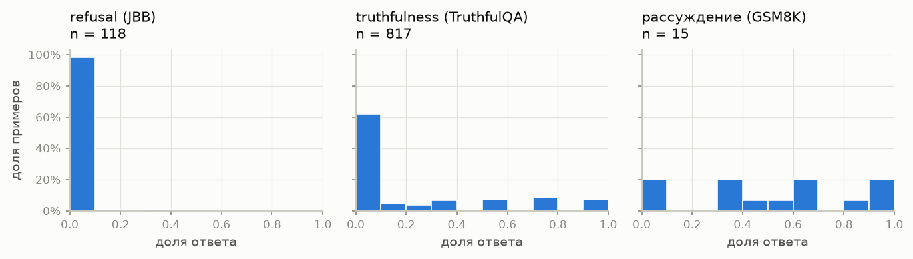
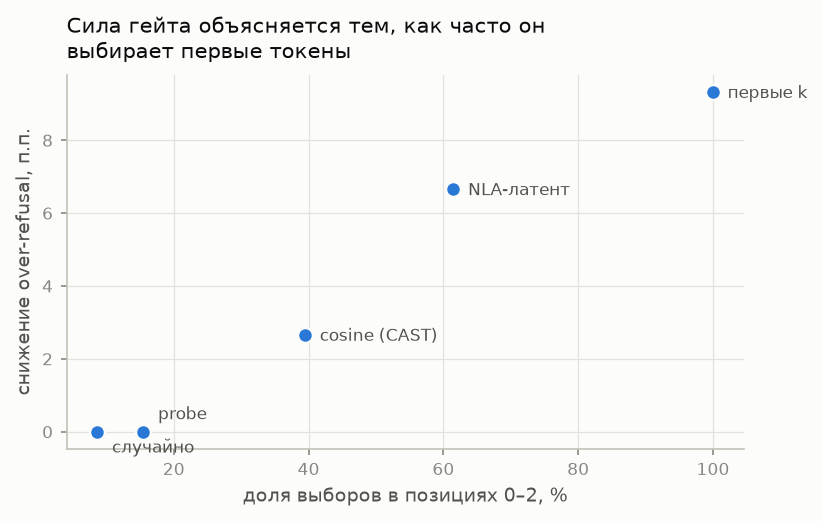

# На каких токенах применять activation steering

## Natural Language Autoencoder как способ выбирать токены

Август-сентябрь 2026

## Аннотация

При activation steering вектор концепта обычно добавляют к активациям на каждом токене ответа, не учитывая, в какой момент модель на самом деле определяет нужное свойство ответа. В этой работе проверяется, можно ли выбирать токены для steering с помощью Natural Language Autoencoder (NLA) — модели, которая переводит активацию в текстовое описание. Правило, по которому выбираются токены, дальше называется гейтом. Основной концепт — отказ модели отвечать (refusal). Правдивость и пошаговое рассуждение взяты как дополнительные задачи, в которых исход ответа определяется в другие моменты.

Все гейты сравниваются при одинаковом числе изменённых токенов. Чтобы понять, какие токены вообще стоит менять, steering применяется ровно к одному токену и проверяется, изменился ли ответ. Удачно выбранный токен исправляет 45% ошибочных отказов, случайный — только 3,5%, причём работают лишь первые три токена ответа. NLA-гейт выбирает их чаще других гейтов, которые смотрят на активацию, но его преимущество пропадает при сравнении с контролем: контроль выбирает позиции с тем же распределением, но без связи с содержанием ответа.

Это не значит, что NLA вообще не годится для гейтинга. Проверен только один способ получить из NLA сигнал — косинус его внутреннего состояния к эталонному. Кроме того, отказ почти всегда решается на первых токенах ответа, так что выбирать токены по содержанию здесь просто не из чего. Интереснее выглядит пошаговое рассуждение: там момент, когда исход ответа фиксируется, распределён по всему ответу.

## 1. Постановка задачи

Пусть модель генерирует ответ $y_1,\ldots,y_T$ на промпт $x$. Через

$$
a_\ell(t)\in\mathbb{R}^d
$$

обозначим активацию остаточного потока на слое $\ell$ в позиции, из которой порождается токен $y_t$. В экспериментах используются слой $\ell=24$ и размерность $d=2048$.

Steering с коэффициентом $\alpha$ задаётся преобразованием

$$
a_\ell(t)\leftarrow a_\ell(t)+\alpha v,\qquad t\in\mathcal T,
$$

где $v\in\mathbb{R}^d$ — вектор концепта, а $\mathcal T$ — множество шагов, на которых выполняется вмешательство. Режиму «все токены» соответствует $\mathcal T=\lbrace 1,\ldots,T\rbrace$, при гейтинге выбирается меньшее множество.

Вектор концепта строится как разность средних:

$$
v=\frac{1}{|\mathcal P|}\sum_{x\in\mathcal P}a_\ell(x)-\frac{1}{|\mathcal N|}\sum_{x\in\mathcal N}a_\ell(x),
$$

где $\mathcal P$ и $\mathcal N$ — положительные и отрицательные примеры (для отказа — вредные и безопасные запросы). Активация берётся на последнем токене промпта. Вредные и безопасные запросы подобраны парами на одну тему, чтобы вектор отражал вредность запроса, а не его тему.

Работа отвечает на четыре вопроса. Есть ли в представлении NLA информация о концепте? Можно ли по этому сигналу найти токены, на которых steering действительно меняет ответ? Лучше ли гейт, который смотрит на активацию, чем простой выбор по номеру позиции при том же числе изменённых токенов? И зависит ли ответ от того, в какой момент концепт проявляется в ответе?

## 2. Методы

### 2.1. Гейты и равное число изменённых токенов

Гейт ставит каждому токену ответа оценку $s(t)$, и steering применяется к $k$ токенам с наибольшей оценкой. Поэтому во всех основных режимах

$$
|\mathcal T|=k.
$$

Фиксированный порог здесь не подходит: разные методы могли бы изменить разное число токенов и выиграть только за счёт того, что вмешиваются меньше. Оценка $s(t)$ всегда считается по активации до добавления steering-вектора.

Сравниваются пять гейтов: случайные $k$ токенов, первые $k$ токенов, проекция активации на $v$, логистическая регрессия по активации (линейный классификатор) и NLA-оценка из раздела 2.2. Три последних будем называть содержательными: они выбирают токены по самой активации, а не по номеру позиции. Гейт по проекции

$$
s_{\mathrm{proj}}(t)=\langle a_\ell(t),\hat v\rangle
$$

соответствует методу CAST (conditional activation steering). Режим «все токены» добавлен как стандартный вариант из литературы, хотя токенов он меняет больше остальных.

Содержательный гейт может выигрывать просто потому, что чаще выбирает удачные позиции, например самые первые токены. Чтобы это проверить, для каждого содержательного гейта строится контроль с перемешанными позициями: ответ $i$ получает те позиции, которые тот же гейт выбрал для другого ответа $j$. Частоты позиций и их сочетания (скажем, «один ранний и один поздний токен») сохраняются, а связь с содержанием текущего ответа пропадает. Если контроль работает так же, как сам гейт, то гейт выигрывает только за счёт позиций.

### 2.2. Natural Language Autoencoder

NLA состоит из вербализатора $\mathrm{av}:\mathbb R^d\to\Sigma^*$ и реконструктора $\mathrm{ar}:\Sigma^*\to\mathbb R^d$. Первый переводит активацию в текстовое объяснение, второй восстанавливает активацию по этому тексту. Насколько хорошо NLA понял активацию, показывает качество восстановления (reconstruction score) — косинус между исходной и восстановленной активацией:

$$
R(a)=\cos\!\left(a,\mathrm{ar}(\mathrm{av}(a))\right).
$$

Генерировать текстовое объяснение для каждого токена слишком дорого. Поэтому для гейтинга текст не генерируется: берётся внутреннее состояние вербализатора $z(a)\in\mathbb R^d$ на последней позиции его промпта, то есть то, с чем он подходит к написанию объяснения. Это состояние дальше называется латентом NLA. NLA-оценка токена — косинус его латента с эталонным латентом:

$$
s_{\mathrm{NLA}}(t)=\cos\!\left(z(a_\ell(t)),z_{\mathrm{ref}}\right).
$$

Эталон $z_{\mathrm{ref}}$ — средний латент тех активаций промптов, у которых наибольшая проекция на $v$. Среднее по всему классу не подходит: в нём почти пропадает то, чем классы отличаются друг от друга (раздел 4.1).

### 2.3. Метрики

Для отказа одновременно измеряются over-refusal, то есть доля отказов на безопасных запросах, и доля отказов на опасных. Первую нужно снизить, вторую сохранить. Если падают обе, steering просто ослабляет отказ как таковой. Отказ определяется по характерным фразам в ответе. Результаты не меняются, если сузить набор фраз до 5 или расширить до 23.

Правдивость оценивается метрикой MC2 из TruthfulQA:

$$
\mathrm{MC2}(x)=\log\sum_{c\in C_{\mathrm{true}}}e^{\bar\ell(c\mid x)}-\log\sum_{c\in C_{\mathrm{false}}}e^{\bar\ell(c\mid x)},
$$

где $\bar\ell(c\mid x)$ — средний по токенам логарифм вероятности варианта ответа $c$. Положительное значение означает, что верные варианты модель считает более вероятными, чем неверные.

Чтобы сравнить, когда разные концепты «решаются» в ответе, вводится момент фиксации исхода — первый шаг, после которого знак метрики исхода больше не меняется:

$$
t^*=\min\left\lbrace t:\mathrm{sign}\,m(\tau)=\mathrm{sign}\,m(T)\quad\forall\tau\ge t\right\rbrace.
$$

Здесь $m(t)$ — значение метрики, посчитанное по промпту и первым $t$ токенам ответа. Величина $t^*$ показывает, с какого шага исход ответа уже не меняется, если смотреть снаружи. Когда решение приняла сама модель, она напрямую не показывает.

## 3. Экспериментальная установка

Эксперименты проведены на Qwen2.5-3B-Instruct в fp16 на одной GPU T4. Используется NLA `rl-v13`, обученный для слоя 24. Вербализатор содержит 36 слоёв, реконструктор 25; активация берётся с выхода слоя 24 без дополнительного масштабирования.

Refusal-вектор строится на JailbreakBench: 100 вредных и 100 безопасных запросов, подобранных по темам и категориям. Итоговая оценка проводится на XSTest, из которого взяты 150 безопасных запросов, внешне похожих на опасные, и 150 действительно опасных. XSTest не используется ни для построения вектора, ни для выбора позиции, ни для подбора параметров.

Позиция, с которой берётся активация для вектора, выбрана 5-кратной кросс-валидацией. Для позиций $-1$, $-2$ и $-3$ получены AUROC $0{,}950$, $0{,}954$ и $0{,}959$ при стандартном отклонении по частям от $0{,}023$ до $0{,}037$. Различия несущественны, поэтому используется последний токен промпта — стандартная позиция сразу после инструкции пользователя.

Работа NLA проверена на активациях четырёх запросов на разные темы: объяснения соответствовали содержанию запросов. Для контроля вместо активации слоя 24 подставлялась активация последнего слоя — тогда NLA выдавал бессвязный текст.

## 4. Результаты

### 4.1. Может ли NLA прочитать steering-вектор

Для настоящих активаций reconstruction score составляет около $0{,}74$, а для заведомо чужих пар (восстановление по объяснению другого текста) около $0{,}52$. Средние активации вредных и безопасных запросов дают $0{,}736$ и $0{,}725$. Если подать в NLA сам steering-вектор, score падает до $0{,}042$; если растянуть вектор до типичной длины активации — $0{,}053$, почти столько же.

Значит, разность средних сама по себе совсем не похожа на активации, с которыми работает NLA, и дело в направлении вектора, а не в его длине. Если же добавить вектор к настоящей активации, NLA его «видит». Для средней активации безопасных запросов с добавкой $+2v$ score равен $0{,}663$, с добавкой $+4v$ — $0{,}520$, а объяснения NLA всё сильнее говорят об осуждении.

Средние активации вредных и безопасных запросов NLA восстанавливает почти одинаково: косинус между восстановленными векторами $0{,}914$, хотя проекция на $v$ разделяет эти классы с AUROC $0{,}95$. Поэтому эталон для NLA-оценки строится по активациям с наибольшей проекцией на $v$, а не как среднее по классу.

### 4.2. Есть ли в латенте NLA информация об отказе

Здесь проверяется, насколько хорошо каждый сигнал отличает токены из ответов-отказов от остальных токенов. Кросс-валидация (5 частей) делит данные по промптам: при делении по отдельным токенам куски одного ответа попали бы и в обучение, и в тест.

| Признаки и способ получения оценки | AUROC на 9561 токене |
|---|---:|
| Логистическая регрессия по активации слоя 24 | $0{,}987\pm0{,}005$ |
| Логистическая регрессия по латенту NLA | $0{,}954\pm0{,}010$ |
| Проекция на $v$ без обучения | $0{,}921$ |
| NLA-оценка: косинус к эталонному латенту | $0{,}608$ |

Информация об отказе в латенте NLA есть, но из исходной активации её извлечь проще. Низкие $0{,}608$ — недостаток способа получения оценки (косинуса к эталону), а не самого латента: классификатор по тому же латенту даёт $0{,}954$. Классификатор, в свою очередь, плохо переносится на другие данные: обученный на активациях промптов и применённый к токенам ответа, он получает около $0{,}61$.

### 4.3. Когда фиксируется исход

Для отказа момент фиксации — это первая фраза отказа. Для правдивости и рассуждения — момент, после которого знак соответствующей метрики не меняется. Максимальная длина ответа — 48 токенов для отказа, 32 для правдивости и 512 для рассуждения.

У отказа в 98% случаев исход ясен уже в первых 10% ответа. Медиана момента фиксации в долях длины ответа равна $0{,}042$, стандартное отклонение $0{,}031$; обычно фраза отказа начинается на втором токене. Даже если склеить в одном запросе безопасную и вредную задачи, отказ начинается в том же месте, разброс нулевой ($0{,}0$). Это ожидаемо: модель видит весь запрос ещё до первого токена ответа.

Для правдивости доля ранней фиксации — 62%, но стандартное отклонение заметно выше, $0{,}315$. У пошагового рассуждения в первых 10% ответа исход фиксируется только в 20% случаев, медиана $t^*$ равна $0{,}513$, стандартное отклонение $0{,}320$. Здесь то, от чего зависит ответ, действительно появляется по ходу решения.

### 4.4. Какие токены стоит менять

Берутся безопасные запросы, на которые модель ошибочно ответила отказом. Steering применяется ровно к одному токену, и проверяется, пропал ли отказ. Если вмешательство позднее и фраза отказа уже написана, стереть её steering не может, поэтому для поздних позиций дополнительно смотрят на часть ответа после вмешательства. Из этой оценки вычитается уровень без steering: фраза отказа стоит в начале, и в конце ответа её часто нет и без всякого вмешательства.

Steering на удачном токене исправляет 45% ошибочных отказов, на случайном — только 3,5%. Работают только позиции с 0 по 2. На позициях с 3 по 23 прирост после вычитания уровня без steering лежит в пределах от $-5$ до $+10$ процентных пунктов. Выбор токена действительно решает, но для отказа всё сводится к первым токенам ответа.

### 4.5. Сравнение гейтов на XSTest

В итоговом сравнении каждый гейт меняет $k=2$ токена на ответ, $\alpha=0{,}5$, длина ответа — 32 токена.

| Режим | Отказ на безопасных (over-refusal), % | Отказ на опасных, % |
|---|---:|---:|
| Без steering | 14,0 | 80,0 |
| NLA-оценка | 7,3 | 72,0 |
| NLA-оценка, перемешанные позиции | 7,3 | 71,3 |
| Проекция на $v$ (CAST) | 11,3 | 71,3 |
| Проекция на $v$, перемешанные позиции | 10,7 | 72,7 |
| Линейный классификатор | 14,0 | 77,3 |
| Первые $k$ токенов | 4,7 | 62,7 |
| Случайные $k$ токенов | 14,0 | 76,7 |
| Все токены | 5,3 | 62,7 |

Если не смотреть на контроли, NLA-оценка лучше других содержательных гейтов: over-refusal падает с 14,0% до 7,3%. Но NLA-гейт в 61,5% случаев выбирает позиции 0–2, то есть именно те первые токены, которые по разделу 4.4 и дают эффект. У проекции на $v$ таких выборов 39,5%, у линейного классификатора 15,5%, у случайного выбора 8,7%, у первых $k$ токенов — все 100%. Чем чаще гейт выбирает первые токены, тем сильнее он снижает over-refusal.

Контроль с перемешанными позициями это подтверждает. У NLA-гейта и его контроля over-refusal одинаковый, 7,3%. У проекции на $v$ контроль даже немного лучше: 10,7% против 11,3%. При $\alpha=1{,}0$ картина та же: контроль проекции лучше самого гейта по обеим метрикам — 7,3% отказов на безопасных и 60,7% на опасных против 8,7% и 51,3%.

Итог для отказа: то, что гейт «видит» в активации, не даёт заметного выигрыша. Всё определяется тем, как часто он выбирает первые три токена.

### 4.6. Правдивость

Первый вектор правдивости построен на истинных и ложных утверждениях из 12 тематических областей. При кросс-валидации по областям (обучение на одних темах, проверка на других) AUROC равен $0{,}876\pm0{,}038$. Активация, взятая в позиции ответа ассистента, работает лучше, чем активация одного лишь предложения: $0{,}876$ против $0{,}777$.

На TruthfulQA этот вектор не работает: предсказать по нему ошибки модели не получается, AUROC $0{,}488$ при случайном уровне $0{,}5$. Более того, steering в сторону «правды» монотонно ухудшает MC2 ($\rho=-0{,}96$), а доля ошибок растёт на 12,7 процентного пункта. Причину видно по проекциям ответов на вектор: у верных ответов по существу в среднем $-1{,}41$, у неверных $-3{,}05$, у верных, но уклончивых $-3{,}52$. Вектор отличает уверенное утверждение факта от уклончивого ответа, а не правду от лжи.

Второй вектор построен прямо на TruthfulQA, с разбиением вопросов на обучающие и проверочные. Верные ответы от неверных он отличает с AUROC $0{,}795$, первый вектор на той же задаче — только $0{,}579$. Косинус между векторами $0{,}086$, то есть они почти перпендикулярны. Слой 24 почти оптимален: $0{,}795$ против $0{,}801$ у лучшего из проверенных слоя 30.

Но и второй вектор не улучшает MC2 статистически значимо. На 260 вопросах steering в обратную сторону (отрицательные $\alpha$) значимо ухудшает результат, $p<0{,}0001$. Для положительных $\alpha$ лучшая точка даёт $p=0{,}163$, а с поправкой Бонферрони на семь проверенных значений $\alpha$ — $p=1{,}0$. Связь с силой вмешательства есть ($\rho=+0{,}64$), но исходная модель лучше половины точек с ненулевым $\alpha$. Раз сам вектор надёжно не помогает, сравнивать гейты для правдивости нет смысла.

## 5. Обсуждение

Несколько раз качество сигнала, измеренное на готовых ответах (AUROC), расходилось с тем, что происходило при настоящем вмешательстве. По AUROC проекция на вектор ($0{,}921$) намного лучше NLA-оценки ($0{,}608$), но в сравнении с реальным steering NLA сначала выглядел сильнее — пока не выяснилось, что его преимущество дают позиции. С правдивостью то же: вектор с AUROC $0{,}795$ значимого улучшения не даёт, а более слабый, с AUROC $0{,}579$, заметно и монотонно ухудшает метрику. Поэтому одного AUROC по косвенной метке недостаточно, чтобы выбирать гейт или steering-вектор.

Прежде чем строить гейт, стоит посмотреть, когда в задаче фиксируется исход (распределение $t^*$). Если почти всегда в самом начале, то к моменту, когда в ответе появляется содержание, всё уже решено, и задача сводится к выбору первых токенов. У отказа так устроена сама постановка: модель видит весь запрос до начала ответа. В пошаговом рассуждении иначе: то, от чего зависит ответ, появляется по ходу решения, и выбор токена там остаётся осмысленной задачей.

## 6. Ограничения

- Из NLA проверен только один сигнал — косинус латента к эталону. Текстовые объяснения и reconstruction score не использовались: для них пришлось бы запускать отдельную генерацию на каждом токене.
- Контроль с перемешанными позициями построен по одной случайной перестановке. Несколько перестановок и доверительный интервал не считались.
- Выборки небольшие. Базовые 14% over-refusal на 150 безопасных запросах — это 21 пример, а карта полезности токенов построена на 20 запросах. Попарные различия между режимами не достигли статистической значимости.
- Использованы один steering-вектор и один random seed. Насколько вектор меняется при другой выборке данных, не проверялось.
- Оценки гейта считаются по ответу, сгенерированному без steering. После вмешательства на ранних токенах дальнейшие активации могут стать другими.
- В итоговом сравнении ответ ограничен 32 токенами. Этого хватает, чтобы увидеть отказ в начале ответа, но не для анализа всего продолжения.
- Линейный классификатор в итоговой таблице обучен на активациях промптов, а применяется к токенам ответа. Если обучить его на токенах ответа, он получает AUROC $0{,}987$.
- Токены выбираются как $k$ лучших внутри каждого ответа, а не по единому порогу для всех ответов. Так число изменённых токенов одинаково у всех методов, но это не пороговое правило, которое можно было бы применять на практике.
- Все основные эксперименты проведены на Qwen2.5-3B-Instruct, перенос на другие модели не проверялся.

## 7. Заключение

Опыт с вмешательством на одном токене подтверждает исходную идею: при одном и том же числе изменённых токенов результат сильно зависит от того, какие это токены. Удачный выбор исправляет 45% ошибочных отказов, случайный — только 3,5%. Но для отказа польза сосредоточена в первых трёх токенах, поэтому гейты, смотрящие на активацию, не лучше контроля с перемешанными позициями.

Проверенная NLA-оценка (косинус латента NLA к эталону) не помогает выбирать токены, хотя информация об отказе в латенте есть: классификатор по нему даёт AUROC $0{,}954$. Сам по себе steering-вектор совсем не похож на активации, с которыми работает NLA: reconstruction score около $0{,}04$ против $0{,}74$ у настоящих активаций. Эти выводы относятся к этому конкретному способу получать сигнал из NLA и к задаче с отказом, а не ко всем возможным применениям NLA.

Продолжать имеет смысл на задачах, где исход решается не в начале ответа. Из рассмотренных лучше всего подходит пошаговое рассуждение: там медиана $t^*$ — около середины рассуждения. Второй открытый вопрос — текстовые объяснения NLA: они ближе к исходной идее проекта, но нужен более дешёвый способ получать их для каждого токена.
